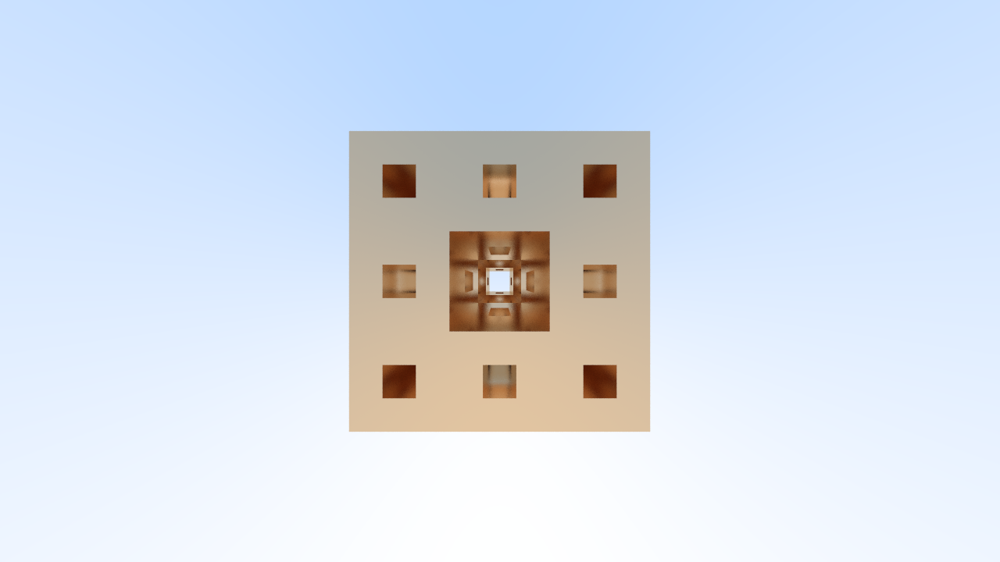
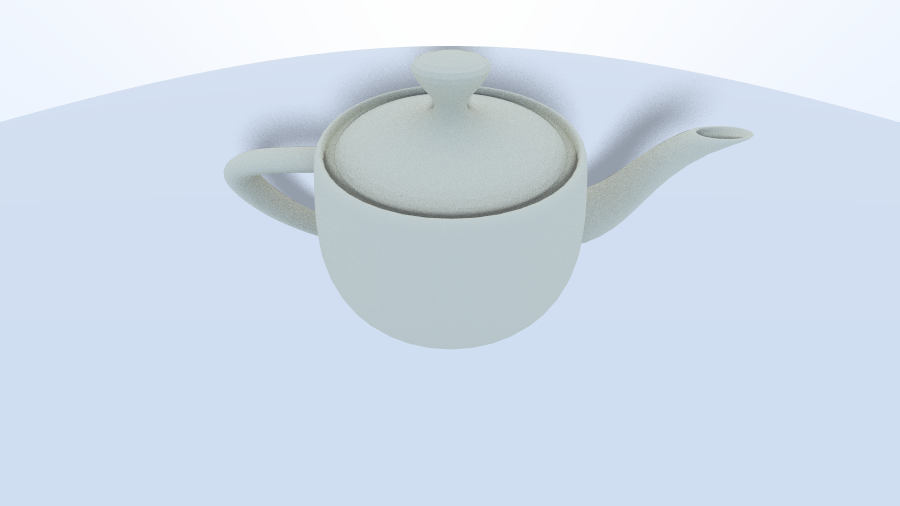

# Raytracer
[](https://opensource.org/licenses/MIT)

This is a very simple raytracer that supports STL files, multithreading and (soft) shadows. With that being said, it is still a work in progress.


## Reasoning behind this project
Rendering objects in games and animated videos has always been dark magic for me and with realtime raytracing coming to relatively new GPUs, 
I finally decided start learning about rendering and the math behind it.

## Getting Started

These instructions will get you a copy of the project up and running on your local machine for development and testing purposes.

### Prerequisites

You will need to have the following programs installed on your system:

1. Rust

### Installing

Clone the repository to your local machine
```bash
git clone https://gitlab.com/CubeArrow/raytracer.git
```

Change directory to `Cubelang`
```bash
cd raytracer
```

Run the program

```bash
./cargo run --package raytracer --bin raytracer
```


## Built With

* [Rust](https://www.rust-lang.org/) - The programming language
* [Theadpool](https://crates.io/crates/threadpool/) - A threadpool for multithreading

## Examples
### Mengers Sponge M<sub>2</sub>


### The Utah Teapot


## Resources

These are very useful resources that I have used to get started with this project

* [Ray Tracing in One Weekend](https://raytracing.github.io/books/RayTracingInOneWeekend.html) - The article I started with when creating this project.
* [Notes on efficient Raytracing](https://graphics.stanford.edu/~boulos/papers/efficient_notes.pdf) - An article that explains how bounding volume hierarchies can be used to make raytracing more efficient.

## License
This project is licensed under the MIT License - see the [LICENSE.md](LICENSE.md) file for details
